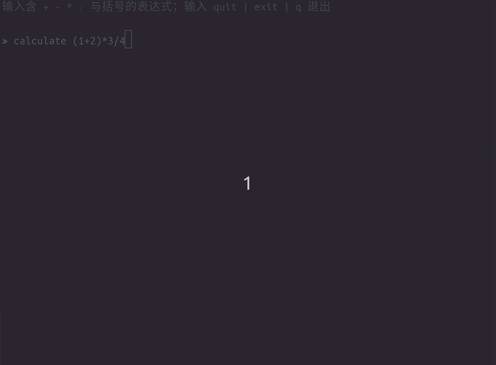

[中文](./README.md) | [English](./README_EN.md)

# 🧮 AI Calculator

*Master-agent + Sub-agents MVP — powered by LangChain ecosystem's [deepagents](https://github.com/langchain-ai/deepagents)*


---

> **This project is a reference implementation designed for migrating and extending to general-purpose scenarios.** The AI Calculator serves as the demonstration vehicle, showcasing deepagents' core orchestration patterns. Use it as a scaffold for any multi-agent collaboration scenario — code review assistants, data analysis pipelines, document generation workflows, and beyond.

## 🎬 Demo



## ✨ Key Features


| Feature                         | Description                                                                                          |
| ------------------------------- | ---------------------------------------------------------------------------------------------------- |
| 🧠 **Master–Sub Architecture**  | One Orchestrator makes centralized decisions, dispatching specialized Sub-agents on demand           |
| 👤 **Human-in-the-Loop (HITL)** | Every critical calculation step requires human approval or rejection for safe, accountable operation |
| 🧩 **Skill Mechanism**          | Each sub-agent is organized as an independent `skills/` folder with clear responsibility boundaries  |
| 🔌 **Swap & Go**                | Replace skill definitions and tool functions to adapt to new domains — zero architecture changes     |


## 🖥️ Quick Start

```bash
# 1️⃣ Install dependencies
uv sync

# 2️⃣ Configure DeepSeek credentials
cp config/.env.example config/.env
# Edit config/.env — fill in your DEEPSEEK_API_KEY

# 3️⃣ Launch the interactive terminal
uv run python main.py
```

Type an expression like `(3 + 5) * 2`, then watch as the Orchestrator decomposes the task, dispatches sub-agents, and requests your confirmation — every step visible in real time.

## 🏗️ Architecture Overview

```
User Input: "(3+5)*2"
    │
    ▼
┌─────────────────────────────────────────────┐
│              Orchestrator                   │
│  (Parse expression, enforce precedence,     │
│   orchestrate execution order)              │
└────┬──────┬──────┬──────┬───────────────────┘
     │      │      │      │
     ▼      ▼      ▼      ▼
  ┌──────────┐  ┌──────────┐  ┌──────────┐  ┌──────────┐
  │   Add    │  │   Sub    │  │   Mul    │  │   Div    │
  │  Agent   │  │  Agent   │  │  Agent   │  │  Agent   │
  └────┬─────┘  └────┬─────┘  └────┬─────┘  └────┬─────┘
     │       │       │       │
     ▼       ▼       ▼       ▼
  ┌──────────────────────────────┐
  │   Tool: Pure Arithmetic      │
  │   → interrupt() for approval │
  └──────────────────────────────┘
     │       │       │       │
     ▼       ▼       ▼       ▼
  ✅ Approve / ❌ Reject + Reason
     │       │       │       │
     └───────┴───────┴───────┘
            │
            ▼
  Orchestrator substitutes result, continues
            │
            ▼
      Final Output: 16
```

### Execution Flow

1. **Orchestrator** receives the user expression and decomposes it into sub-tasks based on operator precedence
2. **Sub-agent** is dispatched to perform a single binary operation (add/subtract/multiply/divide)
3. **Tool function** executes pure arithmetic logic, then calls `interrupt()` to pause the flow
4. **User confirms or rejects**: approval fills back the result; rejection may include a reason for the sub-agent to adjust
5. **Orchestrator** substitutes the approved result back into the expression and continues until the final answer is reached

## 📁 Project Structure

```
.
├── main.py                       # TUI entry point (Rich console UI)
├── agents/
│   └── builder.py                # Constructs Orchestrator + 4 Sub-agents
├── skills/
│   ├── orchestration/SKILL.md    # Orchestrator workflow instructions
│   ├── add/SKILL.md              # Addition skill definition
│   ├── subtract/SKILL.md         # Subtraction skill definition
│   ├── multiply/SKILL.md         # Multiplication skill definition
│   ├── divide/SKILL.md           # Division skill definition
│   └── */scripts/
│       ├── tool.py               # LangChain @tool functions (incl. interrupt)
│       └── *.py                  # Pure arithmetic functions
├── utils/
│   ├── runner.py                 # run_until_complete loop
│   ├── hitl.py                   # HITL type definitions & decision parsing
│   └── llm_client.py             # DeepSeek LLM client
├── tests/
│   ├── test_arithmetic.py        # Arithmetic unit tests
│   ├── test_hitl.py              # HITL parsing unit tests
│   └── test_integration.py       # End-to-end integration tests
├── config/
│   ├── .env.example              # Environment variable template
│   └── .env                      # Your API credentials (not committed)
├── assets/
│   └── ai-calculator.gif         # Screen recording demo
├── pyproject.toml
├── README.md
└── README_EN.md
```

## 🛠️ Tech Stack


| Category        | Technology                                                                    |
| --------------- | ----------------------------------------------------------------------------- |
| Core Framework  | [deepagents](https://github.com/langchain-ai/deepagents) (LangChain)          |
| State Graph     | [LangGraph](https://langchain-ai.github.io/langgraph/)                        |
| LLM Client      | [langchain-openai](https://pypi.org/project/langchain-openai/) → DeepSeek API |
| Terminal UI     | [Rich](https://rich.readthedocs.io/)                                          |
| Package Manager | [uv](https://github.com/astral-sh/uv)                                         |
| Testing         | pytest                                                                        |


## 🧪 Testing

```bash
# Offline unit tests (no network / LLM required)
uv run pytest tests/test_arithmetic.py tests/test_hitl.py -v

# All tests (including E2E, requires network + API key)
uv run pytest tests/ -v
```

## 🔄 Migrating to a New Scenario

Use this project as a scaffold to transform the AI Calculator into any multi-agent scenario:

1. **Define skills**: Create a new `skills/` directory modeled after an existing `SKILL.md`
2. **Implement tools**: Write a new `tool.py`, reusing `interrupt()` for human confirmation
3. **Register agents**: Register new sub-agents and mount their tools in `builder.py`
4. **Adjust orchestration**: Modify the Orchestrator's skill instructions to inform it of new capabilities

> The architecture is designed around **orchestration + confirmation loops**. What you replace is **domain knowledge** and **tool functions**; what you reuse is the **collaboration flow** and **HITL pattern**.

## 📄 License

[MIT](LICENSE)

---

**AI Calculator** — A deepagents multi-agent orchestration MVP reference implementation